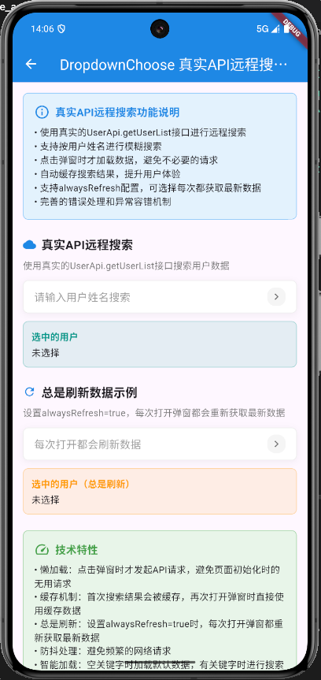
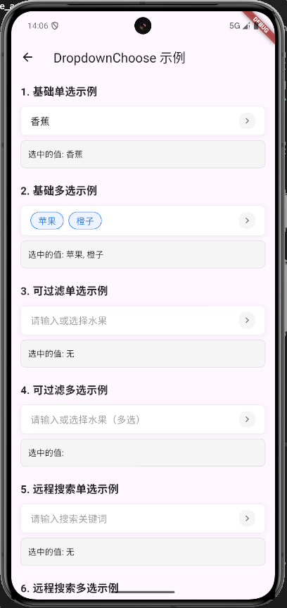

# DropdownChoose 下拉选择组件

一个功能丰富的下拉选择组件，支持单选、多选、本地过滤、远程搜索等多种模式。

## 示例展示




## 功能特性

- 🎯 支持单选和多选模式
- 🔍 支持本地过滤和远程搜索
- 📱 响应式设计，底部弹窗展示
- 🎨 美观的UI设计
- ➕ 支持新增选项功能
- 💾 智能缓存机制
- 🔄 支持数据刷新

## 使用示例

### 基本用法

```dart
import 'package:flutter/material.dart';
import 'package:simple_ui_for_flutter/simple_ui_for_flutter.dart';

class DropdownChooseExample extends StatefulWidget {
  @override
  _DropdownChooseExampleState createState() => _DropdownChooseExampleState();
}

class _DropdownChooseExampleState extends State<DropdownChooseExample> {
  SelectData<String>? selectedFruit;
  List<SelectData<String>> selectedFruits = [];

  final List<SelectData<String>> fruitOptions = [
    SelectData(label: '苹果', value: 'apple', data: 'apple'),
    SelectData(label: '香蕉', value: 'banana', data: 'banana'),
    SelectData(label: '橙子', value: 'orange', data: 'orange'),
    SelectData(label: '葡萄', value: 'grape', data: 'grape'),
  ];

  @override
  Widget build(BuildContext context) {
    return Scaffold(
      appBar: AppBar(title: Text('下拉选择示例')),
      body: Padding(
        padding: EdgeInsets.all(16),
        child: Column(
          children: [
            // 单选模式
            DropdownChoose<String>(
              options: fruitOptions,
              tips: '请选择水果',
              multiple: false,
              onSingleChanged: (value, data, item) {
                setState(() {
                  selectedFruit = item;
                });
                print('选中: ${item.label}');
              },
            ),
            SizedBox(height: 20),
            // 多选模式
            DropdownChoose<String>(
              options: fruitOptions,
              tips: '请选择多个水果',
              multiple: true,
              onMultipleChanged: (values, datas, items) {
                setState(() {
                  selectedFruits = items;
                });
                print('选中: ${items.map((e) => e.label).join(', ')}');
              },
            ),
          ],
        ),
      ),
    );
  }
}
```

### 本地过滤模式

```dart
DropdownChoose<String>(
  options: fruitOptions,
  tips: '搜索并选择水果',
  filterable: true,
  multiple: false,
  onSingleChanged: (value, data, item) {
    print('选中: ${item.label}');
  },
)
```

### 远程搜索模式

```dart
class RemoteSearchExample extends StatelessWidget {
  // 模拟远程搜索API
  Future<List<SelectData<String>>> _searchUsers(String keyword) async {
    // 模拟网络延迟
    await Future.delayed(Duration(milliseconds: 500));
    
    // 模拟搜索结果
    final allUsers = [
      SelectData(label: '张三', value: 'zhangsan', data: 'zhangsan'),
      SelectData(label: '李四', value: 'lisi', data: 'lisi'),
      SelectData(label: '王五', value: 'wangwu', data: 'wangwu'),
      SelectData(label: '赵六', value: 'zhaoliu', data: 'zhaoliu'),
    ];
    
    if (keyword.isEmpty) return allUsers;
    
    return allUsers.where((user) => 
      user.label.contains(keyword)
    ).toList();
  }

  @override
  Widget build(BuildContext context) {
    return DropdownChoose<String>(
      tips: '搜索用户',
      remote: true,
      remoteSearch: _searchUsers,
      alwaysRefresh: true,
      onSingleChanged: (value, data, item) {
        print('选中用户: ${item.label}');
      },
    );
  }
}
```

### 支持新增功能

```dart
DropdownChoose<String>(
  options: fruitOptions,
  tips: '选择或新增水果',
  showAdd: true,
  onAdd: (newValue) {
    print('新增: $newValue');
    // 处理新增逻辑
  },
  onSingleChanged: (value, data, item) {
    print('选中: ${item.label}');
  },
)
```

### 复杂数据类型

```dart
class UserModel {
  final int id;
  final String name;
  final String email;
  final String department;

  UserModel({
    required this.id,
    required this.name,
    required this.email,
    required this.department,
  });
}

class ComplexDataExample extends StatelessWidget {
  final List<SelectData<UserModel>> userOptions = [
    SelectData(
      label: '张三 (技术部)',
      value: 1,
      data: UserModel(
        id: 1,
        name: '张三',
        email: 'zhangsan@example.com',
        department: '技术部',
      ),
    ),
    SelectData(
      label: '李四 (产品部)',
      value: 2,
      data: UserModel(
        id: 2,
        name: '李四',
        email: 'lisi@example.com',
        department: '产品部',
      ),
    ),
  ];

  @override
  Widget build(BuildContext context) {
    return DropdownChoose<UserModel>(
      options: userOptions,
      tips: '选择用户',
      onSingleChanged: (value, data, item) {
        print('选中用户: ${data.name}, 部门: ${data.department}');
      },
    );
  }
}
```

### 默认值设置

```dart
// 单选默认值
DropdownChoose<String>(
  options: fruitOptions,
  defaultValue: SelectData(label: '苹果', value: 'apple', data: 'apple'),
  onSingleChanged: (value, data, item) {
    print('选中: ${item.label}');
  },
)

// 多选默认值
DropdownChoose<String>(
  options: fruitOptions,
  multiple: true,
  defaultValue: [
    SelectData(label: '苹果', value: 'apple', data: 'apple'),
    SelectData(label: '香蕉', value: 'banana', data: 'banana'),
  ],
  onMultipleChanged: (values, datas, items) {
    print('选中: ${items.map((e) => e.label).join(', ')}');
  },
)
```

## API 参考

### DropdownChoose

| 属性 | 类型 | 默认值 | 说明 |
|------|------|--------|------|
| `options` | `List<SelectData<T>>` | `[]` | 选项数据列表 |
| `tips` | `String` | `''` | 占位符文本 |
| `multiple` | `bool` | `false` | 是否多选模式 |
| `filterable` | `bool` | `false` | 是否支持本地过滤 |
| `remote` | `bool` | `false` | 是否启用远程搜索 |
| `remoteSearch` | `Future<List<SelectData<T>>> Function(String)?` | `null` | 远程搜索方法 |
| `alwaysRefresh` | `bool` | `false` | 是否总是刷新数据（仅远程模式） |
| `showAdd` | `bool` | `false` | 是否显示新增按钮 |
| `defaultValue` | `dynamic` | `null` | 默认选中值 |
| `onSingleChanged` | `Function(dynamic, T, SelectData<T>)?` | `null` | 单选回调 |
| `onMultipleChanged` | `Function(List<dynamic>, List<T>, List<SelectData<T>>)?` | `null` | 多选回调 |
| `onAdd` | `Function(String)?` | `null` | 新增回调 |
| `onCacheUpdate` | `Function(List<SelectData<T>>)?` | `null` | 缓存更新回调 |

### SelectData

| 属性 | 类型 | 默认值 | 说明 |
|------|------|--------|------|
| `label` | `String` | **必需** | 显示文本 |
| `value` | `dynamic` | **必需** | 选项值，用于唯一标识 |
| `data` | `T` | **必需** | 关联的数据对象 |
| `disabled` | `bool` | `false` | 是否禁用 |
| `children` | `List<SelectData<T>>?` | `null` | 子选项（用于树形结构） |
| `hasChildren` | `bool` | `false` | 是否有子选项 |

## 回调说明

### onSingleChanged 回调

单选模式下的选择回调：

```dart
onSingleChanged: (dynamic value, T data, SelectData<T> item) {
  // value: 选中项的value值
  // data: 选中项的data对象
  // item: 完整的SelectData对象
}
```

### onMultipleChanged 回调

多选模式下的选择回调：

```dart
onMultipleChanged: (
  List<dynamic> values,
  List<T> datas,
  List<SelectData<T>> items
) {
  // values: 所有选中项的value值列表
  // datas: 所有选中项的data对象列表
  // items: 所有选中项的完整SelectData对象列表
}
```

### onAdd 回调

新增选项的回调：

```dart
onAdd: (String newValue) {
  // newValue: 用户输入的新选项文本
  // 在这里处理新增逻辑，比如添加到数据源
}
```

## 使用限制

1. **filterable 和 remote 互斥**：不能同时启用本地过滤和远程搜索
2. **remote 模式必须提供 remoteSearch**：启用远程搜索时必须提供搜索方法
3. **defaultValue 类型检查**：
   - 单选模式：必须是 `SelectData<T>` 类型
   - 多选模式：必须是 `List<SelectData<T>>` 类型

## 最佳实践

1. **数据结构设计**：确保每个选项的 `value` 是唯一的
2. **远程搜索优化**：使用防抖机制避免频繁请求
3. **缓存策略**：合理使用 `alwaysRefresh` 参数
4. **错误处理**：在远程搜索中添加适当的错误处理
5. **性能优化**：对于大量数据，考虑分页加载

## 注意事项

- 组件会自动处理选中状态的显示和管理
- 远程搜索模式下，数据会被缓存以提高性能
- 多选模式下，选中的项目会以标签形式显示
- 组件支持键盘导航和无障碍访问

## 完整示例

查看 `example/` 目录中的完整示例代码，了解更多使用场景和最佳实践。